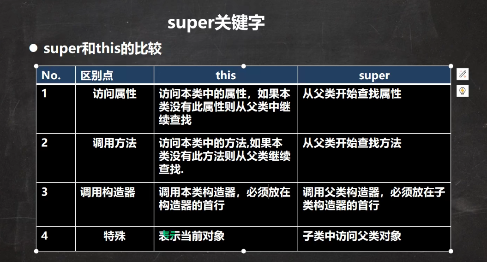

# Java基础知识点细节梳理

## 一、继承

### 构造器使用细节

1. 子类继承了父类所有的属性和方法，但是父类私有属性和方法不能在子类直接访问，要通过父类提供的公共方法去访问。
2. 子类必须调用父类的构造器，完成父类的初始化。
3. 当创建子类对象时，不管使用子类的哪个构造器，默认情况下总会去调用父类的无参构造器；如果父类没有提供无参构造器，则必须在子类的构造器中用super去指定使用父类的哪个构造器去完成父类的初始化工作，否则，编译不通过。
4. 如果希望指定去调用父类的某个构造器，则显式地调用一下。
5. super在使用时，需要放在构造器的第一行。
6. super()和this()都只能放在构造器的第一行，因此这两个方法不能共存在一个构造器中。
7. Java中所有类都是Object类的子类。
8. 父类构造器的调用不限于直接父类。
9. 子类最多只能直接继承一个父类，即Java是单继承机制。
10. 不能滥用继承，子类和父类之间必须满足is-a的逻辑关系。

### super使用细节

1. 调用父类的构造器，分工明确，父类属性由父类构造器初始化，子类属性由子类构造器初始化。

2. 当子类中有和父类中的成员（方法和属性）重名时，为了访问父类的成员，必须通过super。如果没有重名，使用super，this，直接访问效果是一样的。

3. super的访问不限于直接父类，如果父类的父类和本类中有同名的成员，也可以使用super去访问父类的父类中的成员；如果多个基类中都有同名的成员，使用super访问遵循就近原则。

### 访问方法和属性规则

- 先找本类，如果有，则调用
- 如果没有，则找父类，如果有并且可以调用，则调用
- 如果父类没有，则继续向上查找，直到Object类

### this和super的比较



### 方法重写的细节

1. 子类方法的==参数，方法==，要和父类方法的参数，名称完全一致。
2. 子类方法的返回类型和父类方法返回类型一样，或者是父类返回类型的子类型。
3. 子类方法不能缩小父类方法的访问权限。
   [[test.md]]

## 二、多态

### 对象的多态

1. 父类引用可以指向子类
2. 一个对象的==编译类型==和==运行类型==可以不一致。
3. 编译类型在定义对象时就确定了，不能改变
4. 运行类型是可以变化的
5. ==编译类型看定义时的左边,运行类型看的右边==

```java
//animal的编译类型是Animal，运行类型是Dog
Animal animal = new Dog();
//animal的运行类型变为了Cat，编译类型仍然是Animal
animal = new Cat();
```

### 向上转型

```java
class Animal{}
class Pig extends Animal{}
Animal pig = new Pig();
```

本质：父类引用指向了子类

特点：

1. 编译类型看左边，运行类型看右边
2. 可以调用父类中的成员（遵循访问权限）
3. 不能调用子类特有的成员
4. 最终运行效果看子类的具体实现

### 向下转型

```java
class Animal{}
class Pig extends Animal{}
Animal animal = new Pig();

//向下转型
Pig pig = (Pig)animal; 
```

1. 只能强转父类的引用，不能强转父类的对象
2. 要求父类的引用必须指向的是当前目标类型的对象
3. 可以调用子类的所有成员

### 多态属性

属性没有重写之说，属性的值看编译类型。

``instanceOf``比较操作符，用于判断对象的==运行类型==是否是给定类型或其子类型。

### 动态绑定机制

示例：

```java
class A {
    public int ID = 100;

    public int getID() {
        return ID;
    }

    public int sum1() {
        return ID + 10;
    }

    public int sum2() {
        return getID() + 10;
    }
}

class B extends A {
    public int ID = 200;

    public int getID() {
        return ID;
    }

    public int sum1() {
        return ID + 10;
    }

    public int sum2() {
        return ID + 20;
    }
}
```

```java
A a = new B();
System.out.println(a.sum1());    //a的运行类型为B，会先从B类里面找方法sum1，因此结果为210
System.out.println(a.sum2());    //结果为220
```

```java
/**
 *修改B类代码
 */
class B extends A {
    public int ID = 200;

    public int getID() {
        return ID;
    }
}

System.out.println(a.sum1());    //结果为110，属性不绑定
System.out.println(a.sum2());    //结果为210，方法和调用对象的运行内存绑定
```

动态绑定机制原理：

- ==当调用对象方法的时候，改方法会和该对象的内存地址（运行类型）绑定==
- ==当调用对象属性的时候，没有动态绑定机制，哪里声明，哪里使用==

## 三、Object方法

### finalize方法

1. 当对象被回收时，系统自动调用该对象的finalize方法。子类可以重写该方法，做一些释放资源的操作。
2. 什么时候被回收：当某个对象没有任何引用的时候，JVM就认为这个对象是一个垃圾对象，就会使用垃圾回收机制来销毁该对象，在销毁该对象前，会先调用finalize方法。
3. 垃圾回收机制的调用，可以是由系统决定的，也可以通过``System.gc()``主动触发垃圾回收机制。

### toString方法

### equals方法

### getClass方法

## 四、代码块

代码块又称初始化块，属于类中的成员，类似于方法，将逻辑语句封装在方法体中，通过{}包围起来。

但和方法不同，代码块没有方法名，没有返回值，没有参数，只有方法体，而且不用通过对象或类显式调用，而是加载类时，或创建对象时隐式调用。

语法：

```java
[修饰符]{
   代码 
};
```

注意点：

- 修饰符可选，要写的话也只能写static
- 代码块分为两类，使用static修饰的叫静态代码块，没有的叫普通代码块
- 逻辑语句包括输入、输出、方法调用、循环、判断等
- ``;``可以写，也可以省略

使用场景：

如果多个构造器中都有重复的语句，可以抽取到初始化块中，提高代码的重用性。

### 四种代码块

==普通块：==定义在方法中（不管是静态方法还是普通方法），方法被调用时执行

```java
class A {
    public void aaa() {
        System.out.println("aaa方法被执行");

        {
            System.out.println("普通代码块被执行");
        }
    }
}
```

==构造块：==直接定义在类中，但是没有static，优先于构造方法执行，晚于静态块执行

```java
class A {
    {
        System.out.println("构造代码块被执行");
    }
}
```

==静态块：==定义在类中，且有static修饰，最先被执行，且对于一个类的多个对象，只执行一次

```java
class A {
    static {
        System.out.println("构造代码块被执行");
    }
}
```

==同步块：==``synchronized``修饰，和线程相关

### 代码块细节

1. static代码块也叫静态代码块，随着==类的加载==而执行，并且只会执行一次，如果是构造块，每创建一个对象，就执行。

2. 类什么时候被加载
   
   - 创建对象实例时（new）
   - 创建子类对象实例，父类也会被加载（父类先被加载）
   - 使用类的静态成员（静态属性，静态方法）

3. 构造块在创建对象实例时，会被隐式地调用，被创建一次就会调用一次。如果只是使用类的静态成员，构造块不会被调用。

4. 创建一个对象时，执行顺序：
   
   (1)调用静态代码块和静态属性初始化，它们两个的优先级一样，如果有多个静态代码块和静态变量初始化，则按它们的定义顺序执行
   
   (2)调用构造代码块和普通属性的初始化，优先级相同，如果有多个构造代码块和普通属性初始化，则按它们的定义顺序执行
   
   (3)调用构造方法

5. 构造器的最前面隐藏了super()和执行构造代码块。

6. 创建子类的对象时，静态代码块、静态属性初始化、构造代码块、普通属性初始化、构造方法的执行顺序：
   
   (1)父类的静态代码块和静态属性初始化，优先级一样
   
   (2)子类的静态代码块和静态属性初始化，优先级一样
   
   (3)父类的普通代码块和普通属性初始化，优先级一样
   
   (4)父类的构造方法
   
   (5)子类的构造代码块和普通属性初始化，优先级一样
   
   (6)子类的构造方法

7. 静态代码块只能直接访问静态成员，构造代码块可以调用任意成员。

## 五、修饰符

### final

1. final修饰的属性一般叫常量，通常用XX_XX_XX来命名
2. final修饰的属性在定义时，必须赋初值，并且==以后不能再修改==，赋值可以在如下位置：
   - 定义时
   - 代码块中
   - 构造器中
3. 如果final修饰的属性是静态的，则初始化位置只能是在
   - 定义时
   - 静态代码块
4. final类不能继承，但是可以进行实例化
5. 如果类不是final类，但是含有final方法，则该方法虽然不能重写，但是可以被继承
6. final不能修饰构造器
7. final和static往往搭配使用，效率更高，因为底层编译器做了优化处理，不会导致类的加载
8. 包装类都是final类，String类也是final类

## 六、集合

### Collection实现类

#### 特点：

1. Collection实现子类可以存放多个元素，每个元素可以是Object
2. 有些Collection的实现类可以存放重复的元素，有些不可以
3. 有些Collection的实现类是有序的（List），有些是无序的（Set）
4. Collection没有直接的实现子类，而是通过它的子接口List和Set来实现的

#### 常用方法

1. add():添加单个元素

```java
        //创建一个Dog对象
        Dog dog1 = new Dog("小黄", 5);

        ArrayList arrayList = new ArrayList();
        arrayList.add(dog1);
        arrayList.add(1);
        arrayList.add("Tom");
        System.out.println(arrayList);
```

2. remove():删除指定元素

```java
arrayList.remove(dog1);
```

3. contains:()查找元素是否存在

```java
        boolean isContains = arrayList.contains(dog1);
        System.out.println(isContains);
```

4. size():获取元素个数

```java
        int size = arrayList.size();
        System.out.println(size);
```

5. clear():清空集合

```java
        arrayList.clear();
```

6. isEmpty():判断集合是否为空

```java
        boolean isEmpty = arrayList.isEmpty();
```

7. addAll():以集合的形式添加多个元素

```java
        Dog dog2 = new Dog("大黄", 10);
        Dog dog3 = new Dog("小白", 12);
        ArrayList dogs = new ArrayList();
        dogs.add(dog1);
        dogs.add(dog2);
        dogs.add(dog3);

        arrayList.addAll(dogs);
```

8. containsAll():查找多个元素（以集合的形式）是否都在集合中

```java
        boolean isContainsAll = arrayList.containsAll(dogs);
```

9. removeAll():删除多个元素

```java
        arrayList.removeAll(dogs);
```

#### Iterator迭代器

hassNext():判断是否还有下一个元素

next():返回下一个元素，并将指针下移

```java
        //创建三个Dog对象
        Dog dog1 = new Dog("小黄", 5);
        Dog dog2 = new Dog("大黄", 10);
        Dog dog3 = new Dog("小白", 12);

        //创建ArrayList集合，并将三个Dog对象添加进去
        List dogList = new ArrayList();
        dogList.add(dog1);
        dogList.add(dog2);
        dogList.add(dog3);

        //获=获取dogList对应的迭代器对象
        Iterator iterator = dogList.iterator();
        //利用迭代器循环输出，每个Dog对象
        while(iterator.hasNext()) {        //判断是否还有下一个元素
            Object dog = iterator.next();    //下移并返回
            System.out.println(dog);
        }

        //重置迭代器
        iterator = dogList.iterator();
```

使用增强for循环遍历集合

```java
        for(Object dog : dogList) {
            System.out.println(dog);
        }
```

#### List

List接口是Collection接口的子接口，具有以下特点：

- List集合类中的元素有序，即添加顺序和取出顺序一致，且可重复
- List集合中的每个元素都有其对应的顺序索引，即支持索引

##### 常用方法

1. void add(int index, Object obj):在index位置插入一个元素

```java
        List list = new ArrayList();
        list.add("张三丰");
        list.add("张无忌");
        list.add(1, "孙悟空");
```

2. boolean addAll(int index, Collection eles):在index位置插入一个集合

```java
        List list1 = new ArrayList();
        list1.add("猪八戒");
        list1.add("沙僧");
        boolean addAll =  list.addAll(2, list1);
```

3. Object get(int index):获取指定位置的元素

```java
        Object ele = list.get(4);
```

4. nt indexOf(Object obj):返回obj在集合中首次出现的位置

```java
        int num1 = list.indexOf("猪八戒");
```

5. int lastIndexOf(Object obj):返回obj在当前集合中末次出现的位置

```java
        list.add(3, "猪八戒");
        int num2 = list.lastIndexOf("猪八戒");
```

6. Object remove(int index, Object obj):移除指定位置的元素，并返回此元素

```java
        Object obj = list.remove(1);
```

7. Object set(int index, Object obj):设置指定位置的元素为obj，相当于替换元，并返回被替换的元素

```java
        Object obj2 = list.set(0, "唐僧");
```

8. List subList(int fromIndex, int toIndex):返回从fromIndex到toIndex位置的子集合

```java
List list2 = list.subList(0, 3);
```

##### ArrayList

1. ArrayList中维护了一个Object类型的数组elementData

```java
transient Object[] elementData;
//transient表示瞬间的，该属性不会被序列化
```

2. 当创建ArrayList对象时，如果使用的是无参构造器，则初始elementData容量为0，第一次添加，则扩容elementData为==10==，如果需要再次扩容，则扩容elementData为==1.5倍==

3. 如果使用的是指定大小的构造器，则初始elementData容量为指定大小，如果需要扩容，则直接扩容elementData为==1.5倍==

4. ArrayList效率较高，但线程不安全

---

##### Vector

1. 当创建Vector对象时，如果使用的是无参构造器，则初始elementData容量为0，第一次添加，则扩容elementData为==10==，如果再次扩容，则扩容elementData为==2倍==
2. 如果使用的是指定大小的构造器，则初始elementData容量为指定大小，如果再次扩容，则直接扩容elementData为==2倍==
3. Vector是线程安全的

##### LinkedList

1. LinkedList实现了双向链表和双端队列，可以添加任意元素，元素可以重复，包括null值
2. 线程不安全
3. LinkedList中维护了两个属性first和last分别指向首节点和尾节点
4. 每个节点（Node对象），里面又维护了``prev``，``next``，``item``三个属性，其中通过``prev``指向前一个，通过``next``指向后一个
5. LinkedList进行添加和删除操作效率较高

##### ArrayList和LinkedList比较

|            | 底层结构 | 增删的效率   | 改查的效率 |
|:----------:|:----:|:-------:|:-----:|
| ArrayList  | 可变数组 | 较低，数组扩容 | 较高    |
| LinkedList | 双向链表 | 较高，链表追加 | 较低    |

改查操作多，选择ArrayList

增删操作多，选择LinkedList

一般来说，在程序中，80%-90%都是查询，因此大部分情况下会选择ArrayList

#### Set

- ==无序==，即添加顺序和取出顺序不一致，无索引
- 不允许有重复元素，因此最多==只能有一个null==
- 取出的顺序是固定的

##### HashSet

*HashSet实际上是HashMap*

```java
public HashSet() {
    map = new HashMap();
}
```

HaspSet扩容机制：

1. HashSet底层实际上是一个HashMap
2. 添加一个元素时，先得到一个hash值，再转成索引值
3. 找到存储数据表table，看这个索引位置是否已经存放有元素
4. 如果没有，直接加入
5. 如果有，调用equals()方法比较，如果相同，则放弃添加；如果不同，则添加到最后
6. 在Java8中，如果一条链表的元素个数到达了TREEITY_THRESHOLD(默认是8)，并且table的大小>=MIN_TREEIFY_CAPACITY(默认是64)，就会变为红黑树
7. HashSet第一次添加元素时，table数组扩容到16，临界值是16*0.75=12
8. 如果table数组使用到了临界值12，那么table就会进行扩容，16*2=32，新的临界值为32\*0.75=24，以此类推

##### LinkedHashSet

- LinkedHashSet是HashSet的子类
- 底层是一个LinkedHashMap，维护了一个数组+双向链表
- LinkedHashSet根据元素的hashCode值来决定元素的存储位置，同时使用链表来维护元素的次序，这使得元素看起来是以插入顺序保存的
- 不允许添加重复元素

##### TreeSet

### Map实现类

#### 特点

- Map与Collection并列存在，主要用于保存具有映射关系的数据
- Map中的key和value可以是任何引用类型的数据，会封装到HashMap$Node对象中
- Map中的key不允许重复
- Map中的value可以重复
- Map的key可以为个null，value也可以为null，特别的是key为null时只能有一个，而value为null可以有多个
- 常用String类作为Map的key
- key和value之间存在单项一对一的关系，即通过指定的key总能找到对应的value
- 当添加相同的key时，就等价于替换value

==一对Key和Value放在HashMap$Node里，Set集合引用指向Key，Collection实现类引用指向了Value，形成EntrySet集合==

#### 常用方法

1. put():添加

```java
        Map map = new HashMap();
        map.put("红楼梦", "曹雪芹");
        map.put("三国演义", "罗贯中");
        map.put("水浒传", "施耐庵");
        map.put("西游记", "吴承恩");
```

2. remove():根据键删除映射关系

```java
map.remove("三国演义");
```

3. get():根据键获取值

```java
        Object obj =  map.get("西游记");
          System.out.println(obj);
```

4. size():获取元素个数

```java
        System.out.println(map.size());
```

5. isEmpty():判断元素个数是否为0

```java
        System.out.println(map.isEmpty());
```

6. clear():清空Map

```java
        map.clear();
```

7. containsKey():查找键是否存在

```java
        boolean doHave = map.containsKey("三国演义");
        System.out.println(doHave);
```

#### Map的遍历

1. ==通过keySet使用增强for==

```java
        Set keySet = map.keySet();
        System.out.println("书名" + "\t作者");
        for(Object key : keySet) {
            System.out.println(key + "\t" + map.get(key));
        }
```

2. ==通过keySet使用迭代器==

```java
        Iterator iterator = keySet.iterator();
        while(iterator.hasNext()) {
            Object key = iterator.next();
            System.out.println(key + "-" + map.get(key));
        }
```

3. ==通过Values直接获取value==

```java
        Collection values = map.values();
        for(Object value : values) {
            System.out.println(value);
        }
```

4. ==通过Entry获取k-v==

```java
        Set entrySet = map.entrySet();
        for(Object entry : entrySet) {
            Map.Entry m = (Map.Entry) entry;
            System.out.println(m.getKey() + "-" + m.getValue());
        }
```

#### HashMap

- 底层是数组+链表+红黑树
- 线程不安全

#### HashTable

- HashTable的键和值都不能为null
- 线程安全

### 如何选择集合类

1. 先判断存储的类型（一组对象还是键值对）
2. 一组对象：Collection
   - 允许重复：List
     - 增删多：LinkedList
     - 改查多：ArrayList
   - 不允许重复：Set
     - 无序：HashSet
     - 排序：TreeSet
     - 插入顺序和取出顺序一致：LinkedHashSet
3. 一组键值对：Map
   - 键无序：HashMap
   - 键排序：TreeMap
   - 键取出和插入顺序一致：LinkedHashMap
   - 读取文件：Properties

### Collections工具类

#### 排序

- Collections是一个操作Set、List和Map等集合的工具类
- Collections提供了一系列静态的方法对集合元素进行排序、查询和修改等操作
- reverse(List):翻转List中元素的顺序
- shuffle(List):对List元素进行随机排序
- sort(List):根据元素的自然顺序对指定List集合元素按升序排序
- sort(List, Comparator):根据指定的Comparator产生的顺序对List集合元素进行排序
- swap(List, int, int):将指定List集合中的第i处元素和第j处元素进行交换

#### 查找，替换

- Object max(Collection):根据元素的自然排序,返回给定集合中的最大元素 
- Object max(Collection, Comparator):根据Comparator指定的顺序,返回给定集合中的最大元素 
- Object min(Collection):根据元素的自然排序,返回给定集合中的最小元素
- int frequency(Collection, Object):返回指定集合中指定元素的出现次数
- void copy(List dest, List src):将src中的内容复制到dest中去
- boolean replaceAll(List list, Object oldVal, Object newVal):使用新值替换到所有旧值 

## 七、内部类

一个类的内部又嵌套了另一个类结构，里面的类称为内部类，外面的类称为外部类。

属性、方法、构造器、代码块、内部类是类的五大成员。

内部类最大的特点是可以直接访问私有属性，并且可以体现类与类之间的包含关系。

### 四种内部类

#### 局部内部类

局部内部类定义在外部类的局部位置，比如方法中，并且有类名

特点：

1. 可以直接访问外部类的所有成员，包含私有的
2. 不能添加访问修饰符，因为它的地位相当于一个局部变量，局部变量是不能使用修饰符的，但是可以使用``final``进行修饰
3. 作用域：仅仅在定义它的方法或代码块中
4. 外部内访问局部内部类的成员：

```java
//局部内部类
@SuppressWarnings("all")
class OuterClass1 {
    private int n1 = 100;

    private void m2() {
        System.out.println("外部类的私有方法···");
    }

    void m1() {
        class InnerClass1 {
            int n1 = 9;
            public void m3() {
                m2();
                //直接输出n1的话，会采取就近原则，输出的是局部内部类的n1
                System.out.println(OuterClass1.this.n1);
            }
        }
        //作用域在方法内，因此只能在方法内实例化此内部类
        InnerClass1 innerClass1 = new InnerClass1();
        innerClass1.m3();
    }
}
```

5. 如果外部类和局部类的成员重名时，默认遵循就近原则，如果想访问外部类的成员，则可以使用==外部类名.this.成员==去访问

#### *匿名内部类*

匿名内部类定义在外部类中的局部位置，比如方法中，并且没有类名。定义基本语法如下：

```java
new 类或接口（参数列表） {
    类体
};
```

特点：

1. 匿名内部类既是一个类的定义，同时它本身也是一个对象，因此从语法看，它既有定义类的特征，也有创建对象的特征。
2. 可以直接访问外部类的所有成员，包含私有的
3. 不能添加访问修饰符
4. 作用域：仅仅在定义它的方法或代码块中

##### 1、基于接口的匿名内部类

```java
public class AnonymousClass {
    public static void main(String[] args) {
        //匿名内部类
        IA tiger = new IA() {
            public void cry() {
                System.out.println("老虎叫唤···");
            }
        };

        tiger.cry();
    }
}

interface IA {
    public void cry();
}
```

##### 2、基于类的匿名内部类

```java
public class AnonymousClass {
    public static void main(String[] args) {    
        //匿名内部类
        Father father = new Father("Tom") {
            public void test() {
                System.out.println("重写test方法");
            }
        };
        System.out.println(father.name);
        father.test();
        //father对象的编译类型为Father，但运行类型是匿名内部类，即AnonymousClass$2
    }
}

class Father {
    public String name;
    public Father(String name) {
        this.name = name;
    }

    public void test() {
        System.out.println("test");
    }
}
```

使用案例：

```java
interface IB {
    public void show();
}

public class AnonymousClass {
    public static void main(String[] args) {
        //匿名内部类当做实参传递
        ff(new IB() {
            @Override
            public void show() {
                System.out.println("匿名内部类当做实参传递···");
            }
        });
    }

    public static void ff(IB ib) {
        ib.show();
    }
}
```

#### 成员内部类

成员内部类定义在外部类的成员位置，并且没有static修饰

```java
//成员内部类
class OuterClass2 {
    private int n2 = 1000;
    InnerClass2 innerClass2 = new InnerClass2();

    class InnerClass2 {
        public void hi() {
            System.out.println("hi" + n2);
        }
    }

    public void m4() {
        innerClass2.hi();
    }
}

        //外部其他类访问静态内部类
        OuterClass2 outerClass2 = new OuterClass2();
        OuterClass2.InnerClass2 innerClass2 = outerClass2.new InnerClass2();
        innerClass2.hi();
```

1. 可以直接访问外部类的所有成员，包含私有的
2. 可以添加任意访问修饰符
3. 在外部类的静态方法和外部其他类中，必须通过外部类的实例创建内部类的实例
4. 外部类中不能直接访问内部类的成员，而必须通过内部类的实例去访问
5. 外部类实例与内部类实例是一对多的关系
6. 在成员内部类中不能定义static成员，除非同时使用final和static修饰

#### 静态内部类

定义在外部类的成员位置，且有static修饰

```java
//静态内部类
class OuterClass3 {
    public static int n3 = 200;

    static class InnerClass3 {
        public void hello() {
            n3 = 800;
            System.out.println(n3);
        }
    }
}

        //外部其他类访问静态内部类
           OuterClass3.InnerClass3 innerClass3 = new OuterClass3.InnerClass3();
        innerClass3.hello();
```

1. 在创建静态内部类的实例时，不需要创建外部类的实例
2. 静态内部类中可以定义静态成员和实例成员
3. 静态内部类可以直接访问外部类的静态成员，如果要访问外部类的实例成员，则需要通过外部类的实例去访问
4. 可以添加任意的访问修饰符

## 八、泛型

- 编译时检查元素的类型，提高了安全性

- 减少了类型转换的次数，提高了效率

- 可以在类（接口）声明时通过一个标识表示类中某个属性的类型，或者某个方法的返回值类型，或者是方法的参数类型

```java
class Person<E> {
    E e;

    public Person(E e) {
        this.e = e;
    }

    public Person() {}

    public E fun1() {
        return e;
    }
}
```

- 泛型传入类型只能是引用类型
- 在指定泛型具体类型之后，可以传入该类型的子类型或者其子类型

### 自定义泛型

#### 自定义泛型类

```java
class AAA<T,R> {   
    String name;
    R r;
    T t;
}
```

- 普通成员可以使用泛型
- 使用泛型的数组不能初始化
- 静态方法不能使用类的泛型
- 泛型类的类型，是在创建对象的时候确定的
- 如果在创建对象时，没有指定类型，默认为Object

#### 自定义泛型接口

- 泛型接口的类型是要在继承接口或者实现接口时确定

```java
interface IA<U,S> {
    U getU(U u);
    void info(U u, S s);
}
```

#### 自定义泛型方法

- 泛型方法可以定义在普通类中，也可以定义在泛型类中
- 当泛型方法被调用时，类型会被确定

```java
class Teacher {
    //泛型方法
    public <T> T teach(T t) {
        return t;
    }
}
public class Generic02 {
    @SuppressWarnings("all")
    public static void main(String[] args) {
        Teacher teacher = new Teacher();
        //在调用泛型方法的时候确定泛型类型
        System.out.println(teacher.teach(new Student("小王")));
    }
}
```

#### 泛型的继承和通配

- 泛型不具备继承性
- <?>:支持任意类型泛型
- <? extends A>:支持A类及A类的子类，规定了泛型的上限
- <? super A>:支持A类及A类的父类，不限于直接父类，规定了泛型的下限

## 九、String

1. String类时final类，不可被其他类继承
2. String类实现了Serializable接口（可串行化，在网络上进行传输）和Comparable接口（String对象可以比较大小）
3. String字符串的字符使用Unicode编码
4. String的字符存储在``private final char value[]``中
5. ``value``是一个不可修改的字符数组，不可修改指的是不可修改value所指向的地址，而字符数组里面的值是可以被修改的

创建String的两种方式：

方式一：直接赋值，``String s = “Hello Java;”``

先从常量池查看是否有``“Hello Java”``数据空间，如果有，则将s直接指向该地址；如果没有，则需要重新创建，然后指向，最终s指向的是常量池的空间地址

方式二：调用构造器，``String s = new String(“Hello  Java”);``

先在堆中创建空间，里面维护了value属性，指向常量池的``“Hello Java”``空间，如果常量池没有``“Hello Java”``，则重新创建；如果有，直接通过value指向该地址，最终s指向的是堆中的空间地址

```java
        Person p1 = new Person();
        Person p2 = new Person();

        p1.name = "tom";
        p2.name = "tom";

        System.out.println(p1.name.equals(p2.name));//T
        System.out.println(p1.name == p2.name);//T
        System.out.println(p1.name == "tom");//T
```

```java
        String a = "hello";
        String b = "java";
        String c = a + b;
        //1、先创建一个StringBuilder对象sb
        //2、执行sb.append("hello");
        //3、执行sb.append("java");
        //4、执行String c = sb.toString();
        //        public String toString() {
        //            return new String(value, 0, count);
        //        }

        //这里c实际上指向的是堆里的空间        
        System.out.println(c == "hellojava");//F
```

### StringBuffer

#### 构造器

``StringBuffer()``：构造一个不带字符的字符串缓冲区，其初始容量为16个字符

``StringBuffer(CharSequence seq)``：构造一个字符串缓冲区，它包含与指定的CharSequence相同的字符

``StringBuffer(int capacity)``：构造一个不带字符，但具有指定初始容量的字符串缓冲区

`StringBuffer(String str)`：构造一个字符串缓冲区，并将其内容初始化为指定的字符串

```java
        //创建StringBuffer对象
        StringBuffer sb = new StringBuffer(c);
        System.out.println(sb);
        //StringBuffer对象转为String对象法一
        String cc = sb.toString();
        System.out.println(cc);
        //StringBuffer对象转为String对象法二
        String ccc = new String(sb);
        System.out.println(ccc);
```

## 十、反射机制

### JavaBean

- JavaBean是一种Java语言写的可重用组件，可重复使用，就减少代码冗余，方便维护
- JavaBean是一种特殊的类，或者说满足一定规范的类

JavaBean的规范：

1. 必须有包
2. 必须是具体和公共的
3. 必须有公有无参构造
4. 必须有相应的公有的setter和getter方法
5. 建议对象属性私有化

### 反射

- 反射机制允许程序在执行期借助与``ReflectionAPI``取得任何类的内部信息，包括：成员变量，构造器， 成员方法等，并能操作对象的属性即方法，反射机制在设计模式和框架底层使用特别多
- 加载完类后，在堆中就会产生一个`Class`类型的对象（并且一个类只有一个`Class`对象），这个对象包含了类的完整结构信息。通过这个对象得到类的结构。

入门案例：

```java
class Dog {
    public String name;
    public void bark() {
        System.out.println("小狗汪汪叫···");
    }
}

    public static void main(String[] args) throws Exception {
        //获取Dog类的字节码文件
        Class clazz =  Class.forName("lesson4.Dog");
        //获取Dog类的无参构造器
        Constructor constructor = clazz.getDeclaredConstructor();
        //利用无参构造器创建对象
        Dog dog = (Dog) constructor.newInstance();
        //获取Dog类的bark方法
        Method barkMethod = clazz.getMethod("bark");
        //通过反射调用bark方法
        barkMethod.invoke(dog);
    }    
```

反射相关的主要类：

java.lang.Class：代表一个类，Class对象表示某个类加载后在堆中的对象

java.lang.reflect.Method：代表类的方法

java.lang.reflect.Field：代表类的成员变量

java.lang.reflect.Constructor：代表类的构造方法
